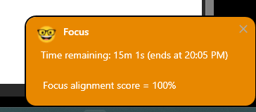

## What was your first impression of the app?
At first, when I used the mobile application, it asked me for the habit. I didn't really connect with it, as I work a rotating shift that could be night or day. Found the focus session really helpful. For someone like me who gets distracted with my own thoughts, the brain dump feature was really helpful. I didn't like that I couldn't skip the feedback popup (got to know that it was intentional).

## Did you find anything difficult to understand?
Not really.

## If you had to explain Focus Bear to a friend in one sentence, what would you say?
Helps you remain on track.

## What are some changes that could improve the new user experience?
I would really love if the focus sessions had a big timer or the small sticky popup to be customizable by the user according to their needs. I would personally remove the focus alignment score and have a big timer ticking (keeps me on check and helps me focus).

