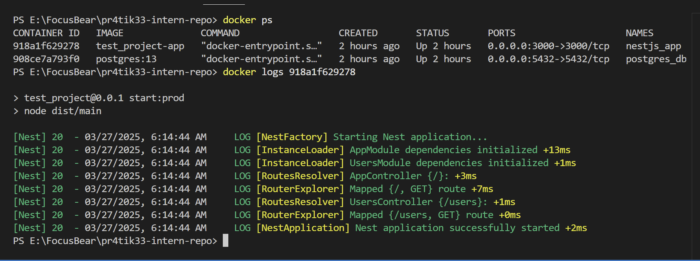
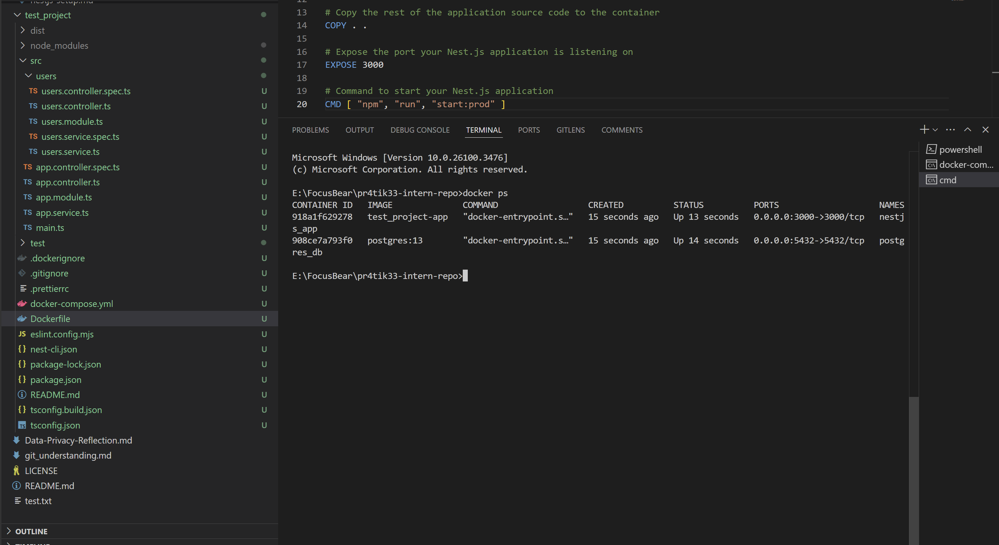
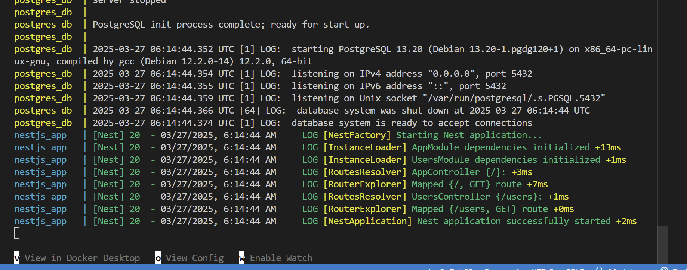
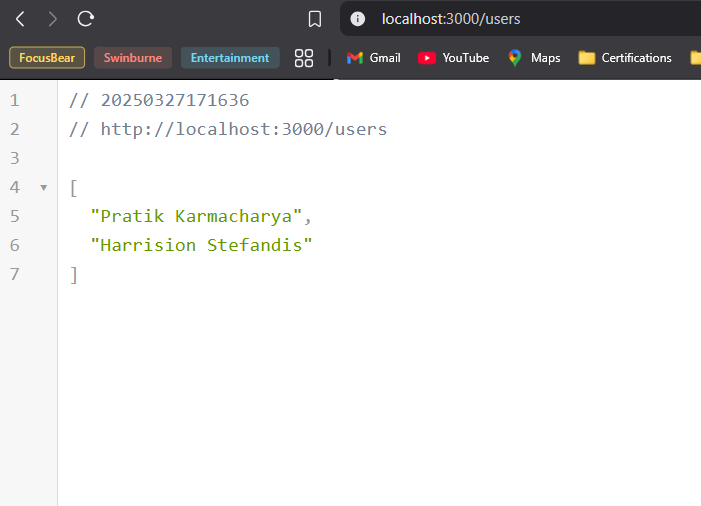
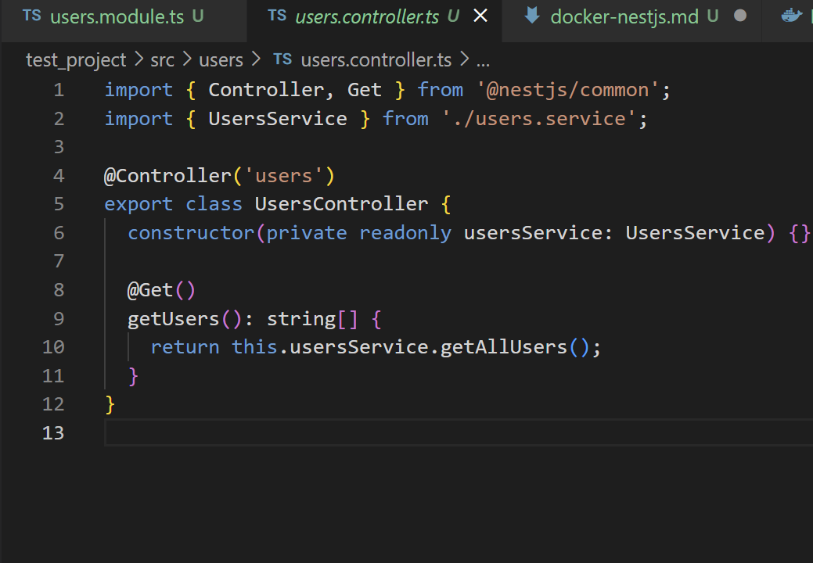
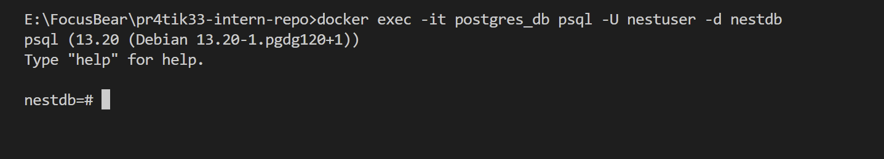

## How does a Dockerfile define a containerized NestJS application?
A Dockerfile specifies how to build a NestJS app image, including the base image, installing dependencies, copying files, setting environment variables, exposing ports, and defining the startup command.

`### Use the official Node.js 16 image as the base image
FROM node:16

### Set the working directory inside the container
WORKDIR /app

### Copy package.json and package-lock.json to the container
COPY package*.json ./

### Install project dependencies
RUN npm install

### Copy the rest of the application source code to the container
COPY . .

### Expose the port your Nest.js application is listening on
EXPOSE 3000

### Command to start your Nest.js application
CMD [ "npm", "run", "start:prod" ]`

## What is the purpose of a multi-stage build in Docker?
A multi-stage build creates smaller images by separating the build environment from the production image, copying only the necessary files to the final image, thus reducing its size.

## How does Docker Compose simplify running multiple services together?
 Docker Compose allows you to define and run multiple services (e.g., NestJS app, database) in one configuration file, managing dependencies and simplifying setup with one command (`docker-compose up`).

## How can you expose API logs and debug a running container?
We can expose API logs by using `docker logs <container_iD>`

To access a container's shell : When we need to interact with the container to inspect
`docker exec -it <container_id> sh`

To view the output of processes running in real time by attaching to container.
`docker attach <container_id>`

Resources: https://dev.to/mrrishimeena/revolutionize-your-nestjs-development-4-steps-to-dockerize-your-nestjs-app-6ea
