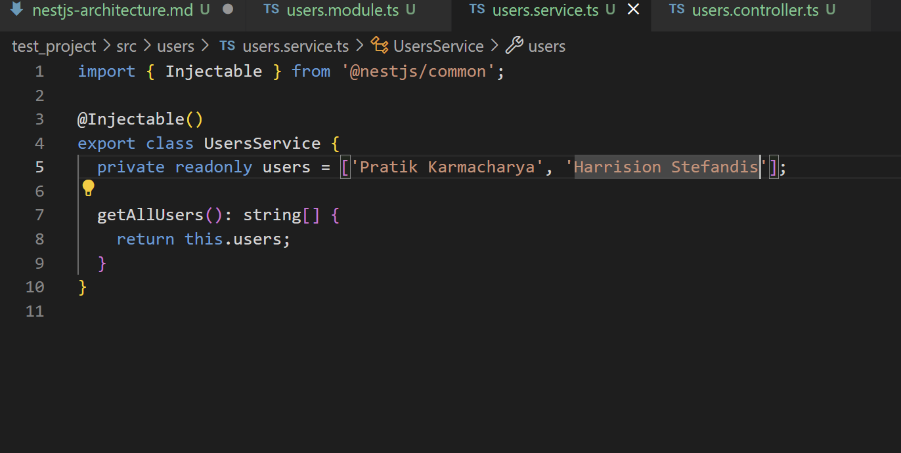

## What is the purpose of a module in NestJS?
A module in NestJS organizes related components (controllers, services, etc.) into a cohesive unit, providing a way to group features and manage dependencies.

## How does a controller differ from a provider?
A controller handles incoming HTTP requests and routes them to appropriate methods, while a provider (usually a service) contains business logic and is injected into other components.

## Why is dependency injection useful in NestJS?
Dependency injection in NestJS promotes loose coupling, easier testing, and better code reusability by automatically managing and injecting service dependencies where needed.

## How does NestJS ensure modularity and separation of concerns?

NestJS uses a modular architecture, where each module encapsulates specific functionality, ensuring that components (controllers, services, etc.) are isolated and only communicate through well-defined interfaces.

Task Screenshots:

