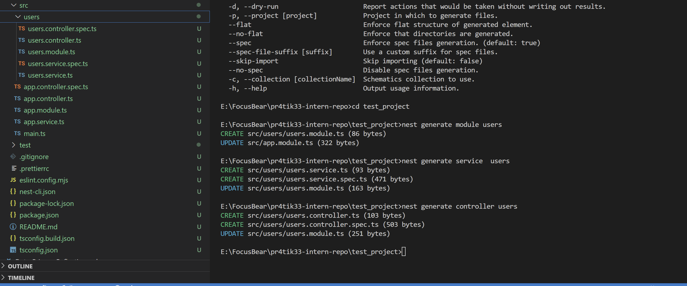

## How does the NestJS CLI help streamline development?
The NestJS CLI helps to automate project setup, code generation, and common tasks, reducing manual work and enforcing best practices.

## What is the purpose of nest generate?
The nest generate command creates modules, controllers, services, and other components automatically, ensuring a structured and maintainable codebase enforcing best practices.
## How does using the CLI ensure consistency across the codebase?
The CLI follows NestJS conventions, generating files with a uniform structure, reducing human errors, and maintaining best practices across the project.

## What types of files and templates does the CLI create by default?
By default, the CLI creates modules, controllers, services, providers, interceptors, middleware, and decorators, each following NestJS’s predefined templates.

task screenshots:
