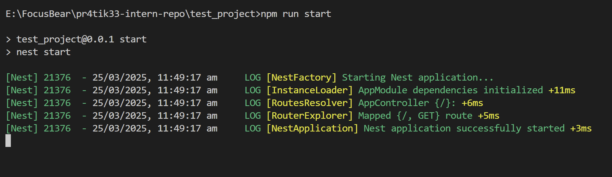
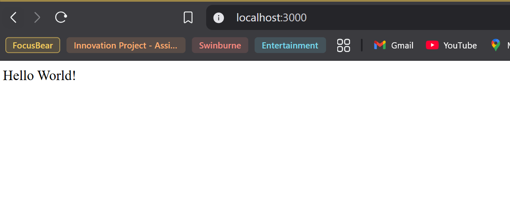

## What files are included in a default NestJS project?
Files that included in a default NestJS project are listed below:
1. Dist folder
2. node_modules folder
3. src folder
4. test folder

and the core files are listed below:

**app.controller.spec.ts** -	The unit tests for the controller.
**app.controller.ts** - A basic controller with a single route.
**app.module.ts** - The root module of the application.
**app.service.ts** -	A basic service with a single method.
**main.ts**	- The entry file of the application which uses the core function NestFactory to create a Nest application instance.

## How does main.ts bootstrap a NestJS application?
1. Creating the NestJS Application
The main.ts file calls `NestFactory.create(AppModule)`, which creates an instance of the NestJS application using the root module (AppModule). This sets up the dependency injection container, loads modules, and prepares the app to handle requests.

2. Starting the HTTP Server
After creating the app instance, `app.listen(port)` starts the HTTP server, making the application accessible on the specified port.

Workflow of main.ts
-Import NestFactory and AppModule.
-Create the NestJS application instance.
-Apply any necessary configurations (e.g., validation, CORS).
-Start listening for incoming requests.

## What is the role of AppModule in the project?
The AppModule serves as the central hub where all modules required by the application are registered. It plays a crucial role in structuring the application by managing modules, controllers, and services, ensuring scalability and maintainability. Additionally, AppModule is often used for global configurations, such as setting up middleware, validation, and third-party integrations, making it a key component in initializing and organizing the NestJS application.

## How does NestJS structure help with scalability?

The framework is built with a modular architecture, allowing developers to divide their applications into modules. Each module encapsulates related components, controllers, and services, promoting a clear separation of concerns and making the codebase more manageable and scalable.

source: https://curatepartners.com/blogs/skills-tools-platforms/nestjs-building-scalable-and-maintainable-server-side-applications-with-typescript/#:~:text=The%20framework%20is%20built%20with,codebase%20more%20manageable%20and%20scalable.

