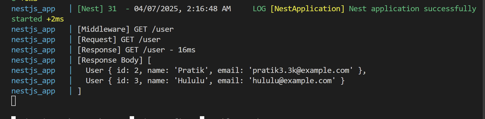
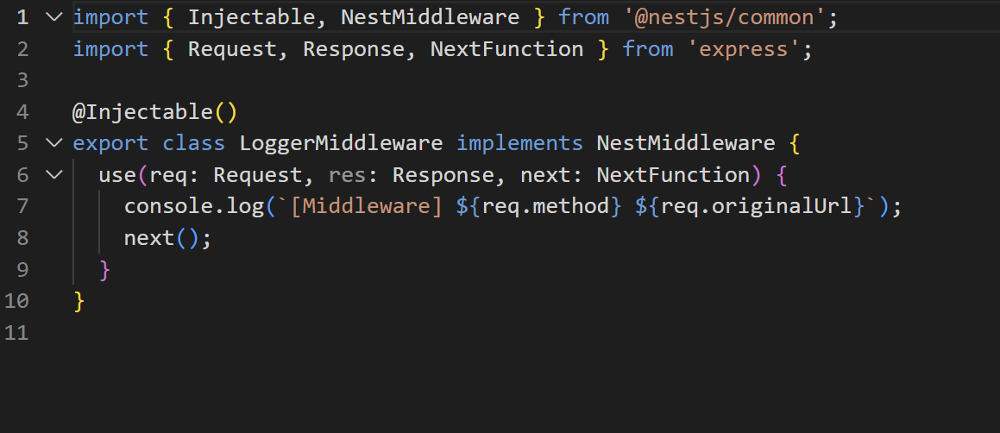
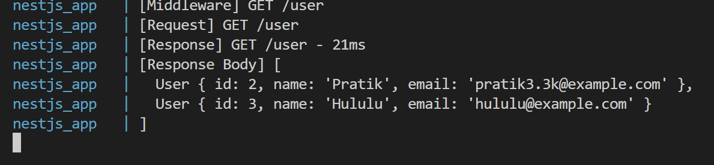
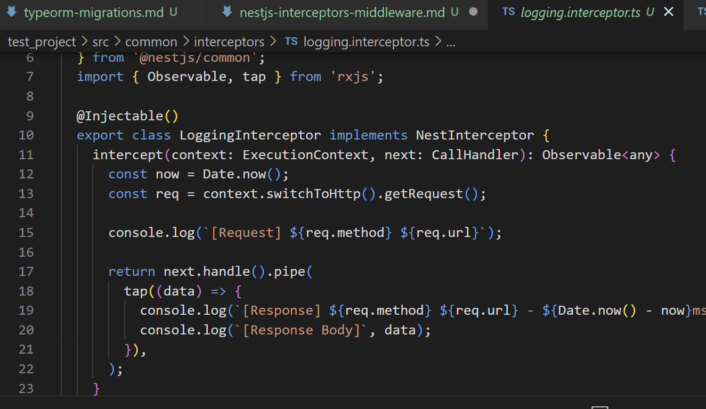

## What is the difference between an interceptor and middleware in NestJS?

Middleware runs **before the request** reaches the controller. It's great for things like logging, and authentication. Interceptors, on the other hand, wrap around controller method execution, giving access to both **before and after** logic — great for response transformation, caching, logging, or error handling.

## When would you use an interceptor instead of middleware?

Use an interceptor when you need access to the controller’s response or want to manipulate the response (e.g., format data, wrap it in a success object). Middleware can’t see or modify the response returned by the controller.

## How does LoggerErrorInterceptor help?

LoggerErrorInterceptor is a custom interceptor that can catch errors thrown in the app, log them, and transform them into a clean, consistent error response for the client. It centralizes error logging and improves debugging and monitoring.

Task:

