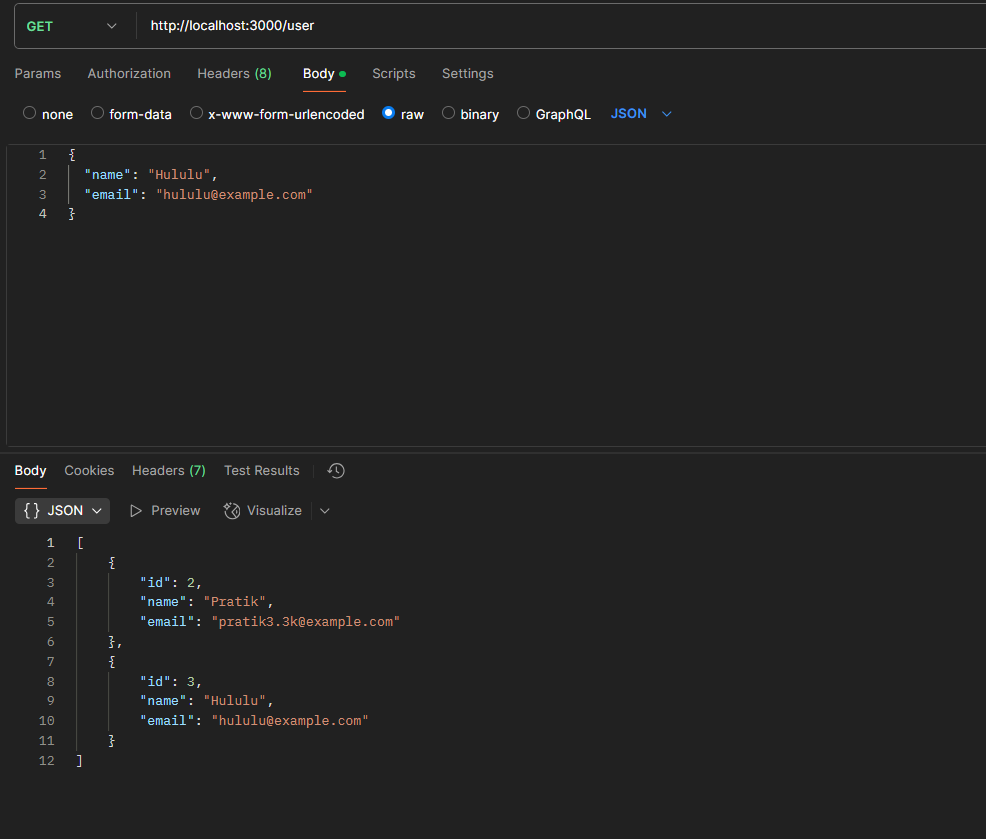

Tasks:
Use of services for business logic.

Create a controller with basic CRUD routes (GET, POST, PUT, DELETE)

Testing endpoints

## What is the role of a controller in NestJS?
A controller in NestJS handles incoming HTTP requests and returns responses. It acts as the entry point for routing requests to the appropriate service or logic.

## How should business logic be separated from the controller?
Business logic should be placed in services, not controllers. Controllers should only handle request validation, routing, and response formatting, delegating complex operations to services.

## Why is it important to use services instead of handling logic inside controllers?
Using services promotes code reusability, maintainability, and separation of concerns. It keeps controllers lightweight and focused on handling HTTP requests.

## How does NestJS automatically map request methods (GET, POST, etc.) to handlers?
NestJS uses **decorators** like `@Get()`, `@Post()`, `@Put()`, and `@Delete()` to map HTTP methods to specific controller methods, making routing intuitive and declarative.