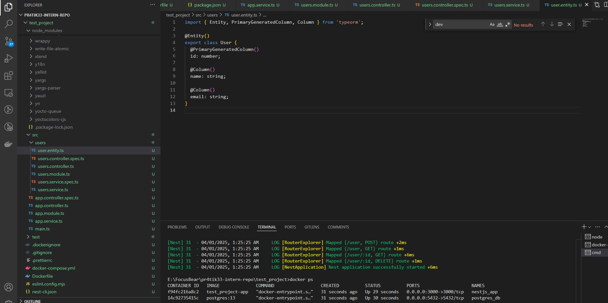
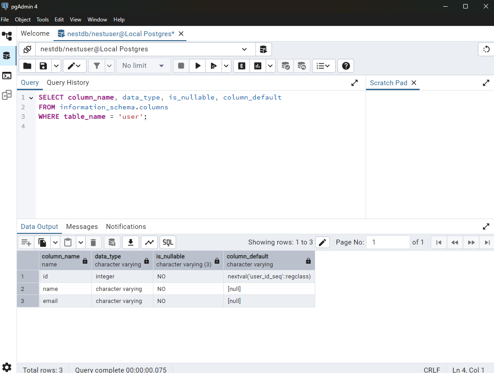
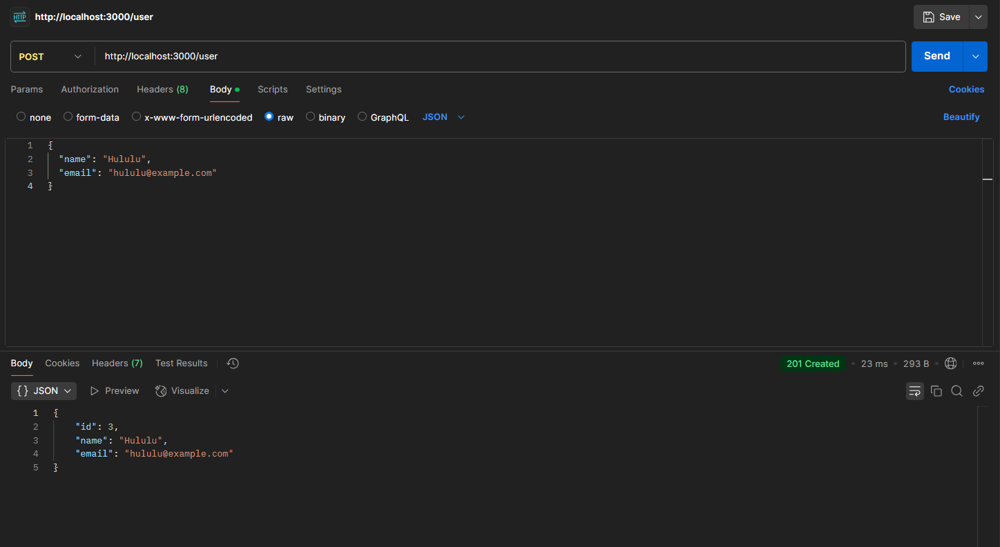
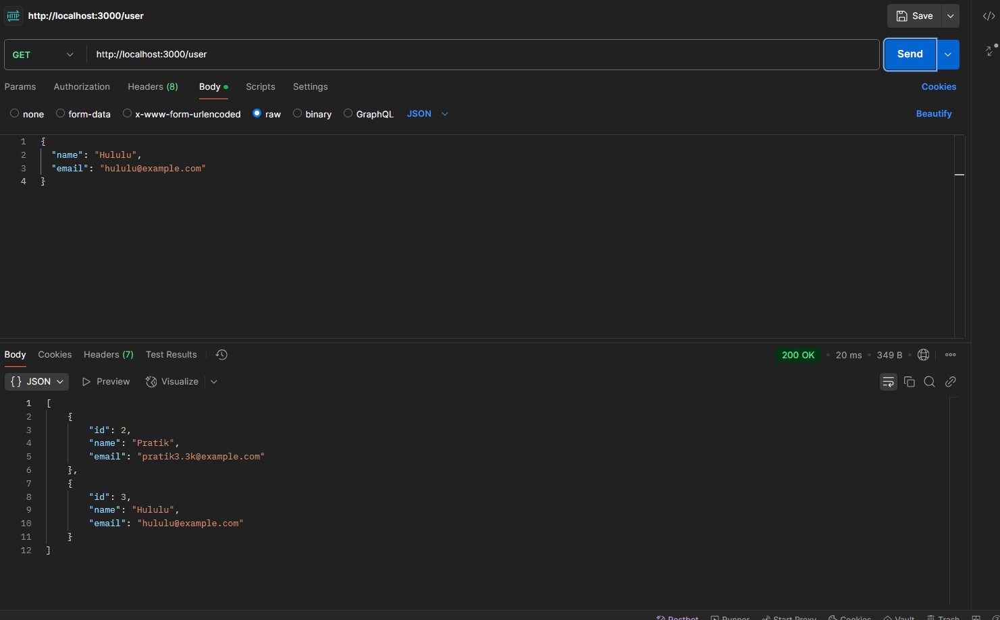

Screenshot of the created table using typeorm:
### Screenshot of the created table using TypeORM

  

### Using Post and Get

#### POST Request Example

#### GET Request Example

## How does @nestjs/typeorm simplify database interactions?
@nestjs/typeorm integrates TypeORM with the NestJS framework, providing decorators and dependency injection to simplify database interactions. It allows you to define entities, repositories, and relationships using TypeScript decorators, and it automatically handles database connections, queries, and transactions. Additionally, it supports features like module-based architecture, making it easier to organize and manage database-related logic.

## What is the difference between an entity and a repository in TypeORM?

Entity: An entity is a class that maps to a database table. It defines the structure of the table, including columns, data types, and relationships. Entities are decorated with TypeORM decorators like `@Entity()`, `@Column()`, etc.

Repository: A repository is a service provided by TypeORM to interact with entities. It provides methods to perform CRUD operations, such as find, save, update, and delete. Repositories abstract away the complexity of writing raw SQL queries.

## How does TypeORM handle migrations in a NestJS project?

TypeORM uses a CLI to manage migrations. We can generate migrations with `npx typeorm migration:generate -n MigrationName`, apply them with `npx typeorm migration:run`, and revert them with `npx typeorm migration:revert`. This ensures schema changes are version-controlled and consistent.

## What are the advantages of using PostgreSQL over other databases in a NestJS app?
PostgreSQL is a preferred choice for NestJS apps because it is fully supported by TypeORM, which integrates seamlessly with NestJS. Also offers advanced features like JSON/JSONB and strong ACID compliance.