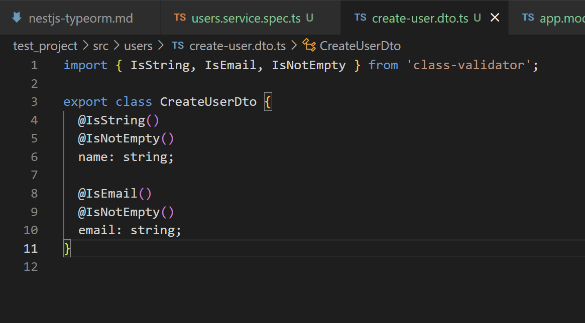
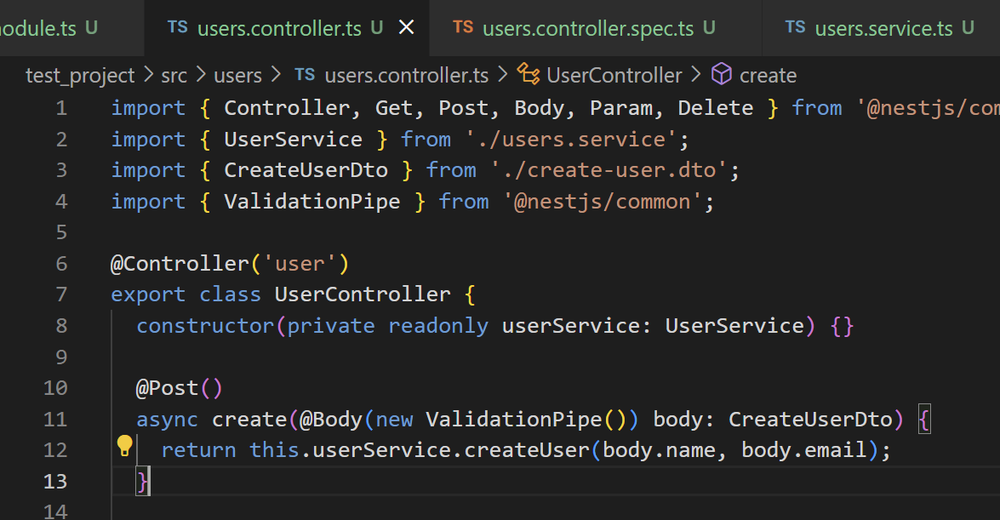
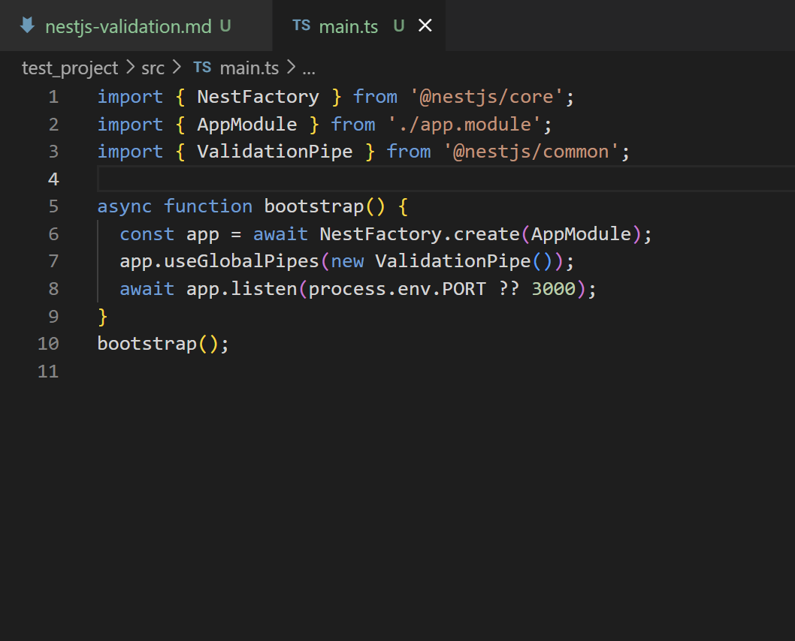

## What is the purpose of pipes in NestJS?
Pipes in NestJs are tools that helps to validate incoming data before begin processed by the route handler.

## How does ValidationPipe improve API security and data integrity?
- Preventing from sql injections and malformed requests.
- can automatically convert input data into expected types, ultimately reducing applicationa logic errors.
- Ensures incoming data follows the defined structure and constraints in DTO (Data Transfer Object).
## What is the difference between built-in and custom pipes?
- Built in pipes are provide by NestJs out of box whereas custom pipes are created by devs.
- Built in pipes  only have commons use cases ready to use whereas any custom logics can be created in custom pipes by devs.

## How do decorators like @IsString() and @IsNumber() work with DTOs?

`import { IsString, IsNumber } from 'class-validator';

export class CreateUserDto {
  @IsString()
  name: string;

  @IsNumber()
  age: number;
}`

example