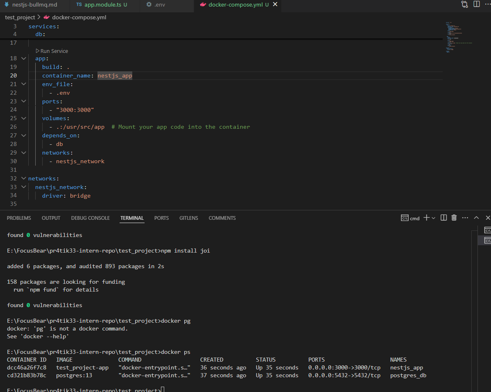
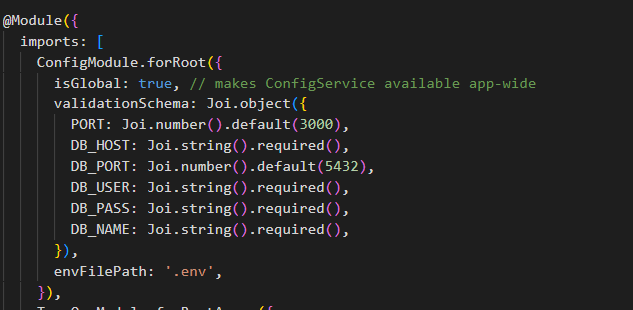

# Reflections
## How does @nestjs/config help manage environment variables?
The @nestjs/config package simplifies the management of environment variables in a NestJS by automatically loading varibales form a .env file, providing a ConfigService to access env varibales througout the app.

## Why should secrets (e.g., API keys, database passwords) never be stored in source code?
Having secrets in the source code increases the chance of them being exposed causing security risks.

## How can you validate environment variables before the app starts?
We can validate environment variables using the `@nestjs/config` package with a validation schema (e.g., using Joi):

1. Define a validation schema in your ConfigModule setup.
2. If a required variable is missing or invalid, the app will throw an error and fail to start.

## How can you separate configuration for different environments (e.g., local vs. production)?
We can set the `NODE_ENV` variable and load environment-specific `.env` files (e.g., `.env.local`, `.env.production`) using `ConfigModule`.

# Tasks:
Using .env file instead of hardcoded variables.

Validating enivoronment varibales
