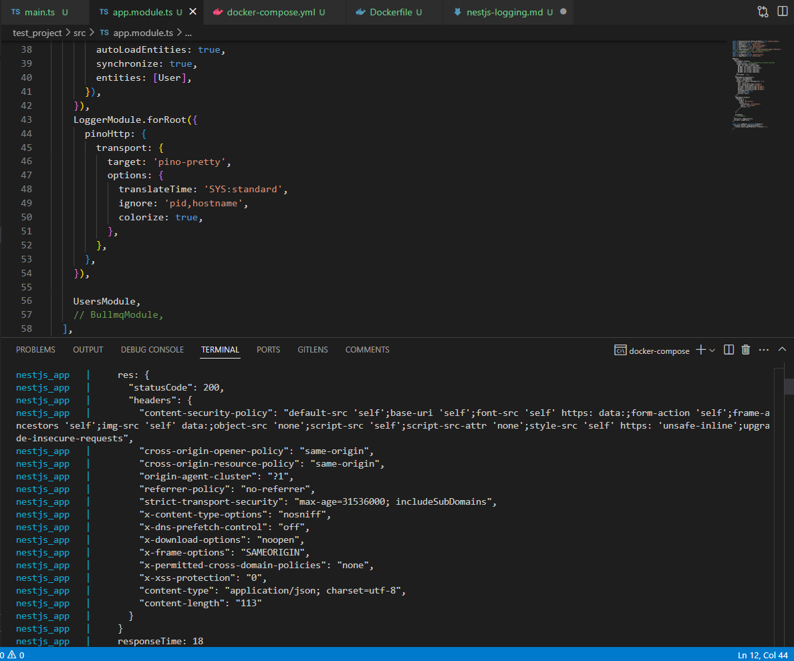

## What are the benefits of using nestjs-pino for logging?
- Logs are JSON formatted making it easier to read and parse them.
- Easily integrates with NestJs.
- Allows different configuration of log levels , formatting etc making it more customizable .
## How does global exception handling improve API consistency?
- Ensures uniform error responses.
- Centralizes error formatting and logging.
- Makes debugging and client-side handling easier.
## What is the difference between a logging interceptor and an exception filter?
Logging interceptor logs every request/response whereas exception filter catches and handles thrown errors globally.

## How can logs be structured to provide useful debugging information?
By including timestamp, request ID, routes , user info etc with proper formatting to maintain redability something like JSON.

Task:
