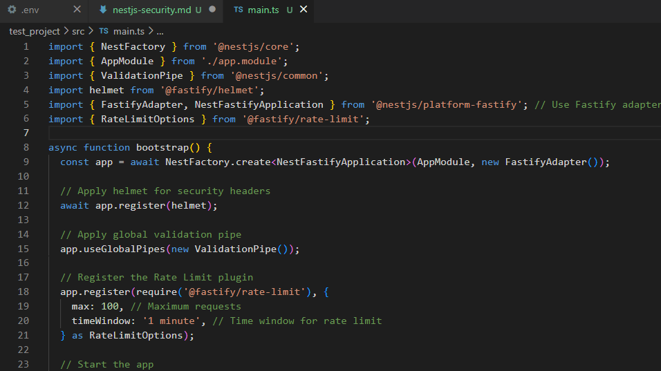

# Reflection
## What are the most common security vulnerabilities in a NestJS backend?
Injection attacks, XSS , CSRF , Sensitive data exposure,DoS attacks are the most common security vulnerabilities in a NestJS backend.

## How does @fastify/helmet improve application security?
@fastify/helmet adds security-related HTTP headers to protect the application from common vulnerabilities. With features like content security policy , X-frame options , Strict transport security (HSTS) etc.

## Why is rate limiting important for preventing abuse?
Rate limiting prevents from DoS attacks, API abuse  and Brute force attacks by limiting the number of login attempts to prevent credential guessing.

## How can sensitive configuration values be protected in a production environment?
In production environment tools such as Azure key Vaults , AWS secrets Manager could be used to securely store and retrieve secrets, another technique could be using access control on environment variable and also avoiding to commit .env file.

Task:
Applying rate limit and using helmet to secure HTTP headrs.
