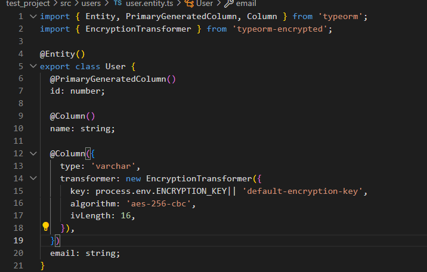

## Why does Focus Bear double encrypt sensitive data instead of relying on database encryption alone?
For a double layer of safety if the database is compromised, sensitive user data remains protected, and also to meet the security standard as well.
## How does typeorm-encrypted integrate with TypeORM entities?
`typeorm-encrypted` integrates with TypeORM entities by using the `@Column` decorator with an `EncryptionTransformer`. This transformer automatically encrypts data before saving it to the database and decrypts it when retrieving it. It requires configuration with an encryption key, algorithm, and IV length, ensuring sensitive data is securely handled at the application level.

## What are the best practices for securely managing encryption keys?
- Best Practices for Securely Managing Encryption Keys:
- Use Secret Management Tools: Store keys in tools like AWS Secrets Manager, Azure Key Vault, or HashiCorp Vault.
- Environment Variables: Load keys securely from environment variables, avoiding hardcoding in source code.
- Key Rotation: Regularly rotate encryption keys to minimize the impact of potential leaks.
- Access Control: Restrict access to keys to authorized personnel and systems only.
- Encryption: Encrypt keys at rest and in transit to prevent unauthorized access.
- Audit and Monitoring: Log and monitor access to encryption keys for suspicious activity.

## What are the trade-offs between encrypting at the database level vs. the application level?

- Database-level encryption is managed by the database, while application-level encryption gives developers full control over the encryption process.
- Database-level encryption protects data at rest, whereas application-level encryption provides end-to-end protection, including data in transit.
- Database-level encryption is easier to implement, while application-level encryption increases complexity but offers greater flexibility and security.

