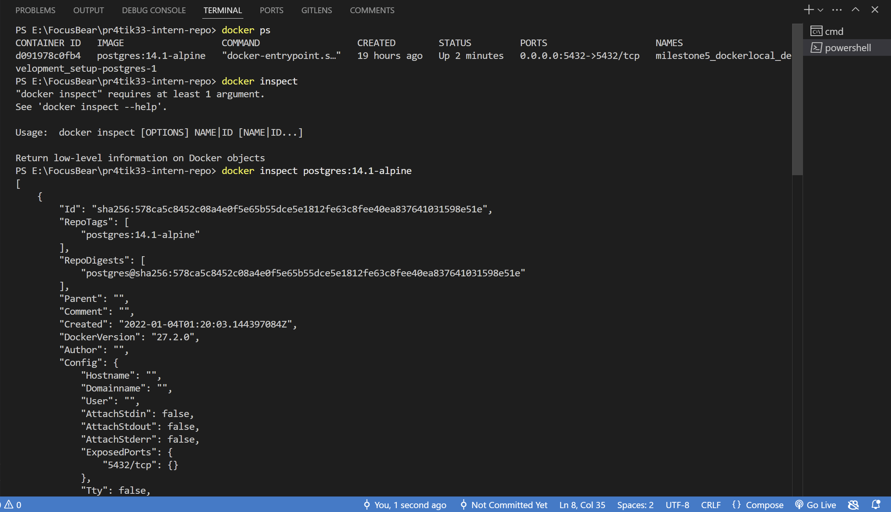

## How can you check logs from a running container?
We can check logs from the Docker UI as well as from the terminal by simply using command below.
`docker logs <container_id>`
## What is the difference between docker exec and docker attach?
- `docker exec` runs the commands inside a running container in a new process whereas `docker attach` attaches to the main process of a container and interacts with it.
- `docker exec` can be used for debugging and interacting with container's file or env, `docker attach` 
can be used for interacting with running process, but not for running new commands

Note for self: `docker exec -it <container_id > bash or ssh `  here it stand for interactive , TTY - Pseudo-terminal . 
## How do you restart a container without losing data?
By using the volume we can make sure that we dont lose data while restarting.

## How can you troubleshoot database connection issues inside a containerized NestJS app
- checking NestJS app logs for any specific database related errors.
- check env varibales for correct database credentials.
- Use `docker exec` to run a test inside the app container to check database connectivity.
    `docker exec -it <container_id> ping <db_host>`