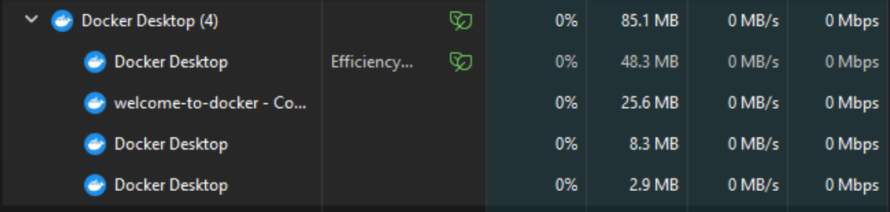

Running services :

## Learning Resource source: https://www.youtube.com/watch?v=gAkwW2tuIqE

## What is the difference between docker run and docker-compose up?

**docker run** command is used to create and run a single container whereas **docker-compose up** command is used to start multiple containers defined in a docker-compose.yml file. 

Note for self: Docker runs only one process per container because it is designed to run a single, isolated process

## How does Docker Compose help when working with multiple services?

Docker Compose simplifies the management of multi-container applications. With Compose, you define the entire stack (multiple services, networks, and volumes) in a single YAML file (docker-compose.yml). You don’t need to manually manage individual containers or their dependencies; Docker Compose will handle the orchestration and startup order for you. This makes it easier to deploy and scale applications that require several interconnected services, such as a web app and a database.

Note for self: Volumes are a mechanism for storing data outside containers(reason : once the container is stopped all the local data are lost).

## What commands can you use to check logs from a running container?
`docker logs <container_name_or_id>` command can be used to check logs from a running container.
`docker logs -f <container_name_or_id>` to view real-time logs. (`-f `(follow))

## What happens when you restart a container? Does data persist?

When a docker container is restarted, any data created or modified inside the container will be lost once the container is stopped or restarted unless volumes or bind mounts are used.